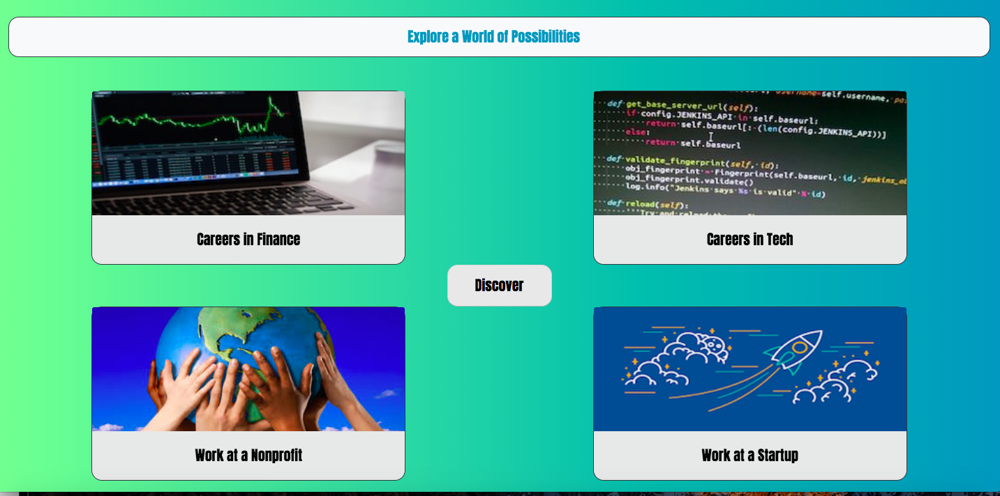

# Job Discovery App
Interactive application that takes in a user's preferences, and then recommends a potential company that might be a good match

## Project Description
User rates their level of agreement with a series of statements on a scale from 1-5, and then receives a customized recommendation

[The deployed version is accesible here](https://jobdiscoveryapp.herokuapp.com/)

### Technologies Used

html, css, javascript, jquery, animate.css, bootstrap, Google Fonts, npm, express, bodyparser, path

#### Additional Notes

The back-end (companies/ratings) is being continuously updated
